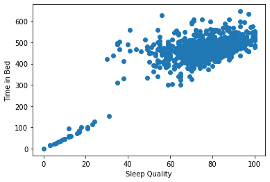

# Preprocessing the Data

#### Define the features set.
X = df.copy()
X = X.drop(columns=["Sleep quality"], axis=1) # features
y = df["Sleep quality"].ravel() # target

#### Splitting into Train and Test sets.
from sklearn.model_selection import train_test_split
X_train, X_test, y_train, y_test = train_test_split(X, y, random_state=78)

#### [Back to Home](https://mtomison.github.io/Sleep_Analysis/)
