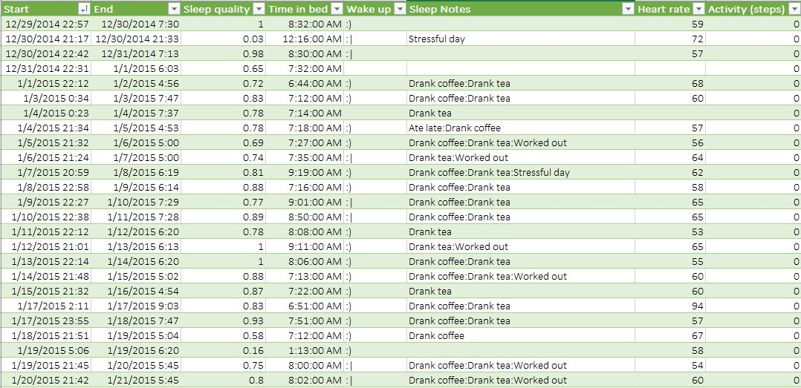
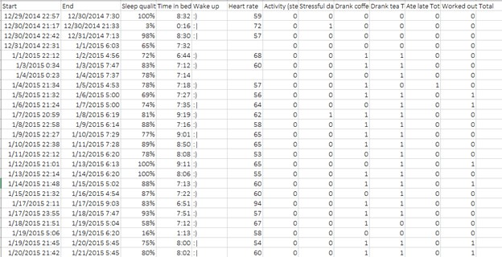
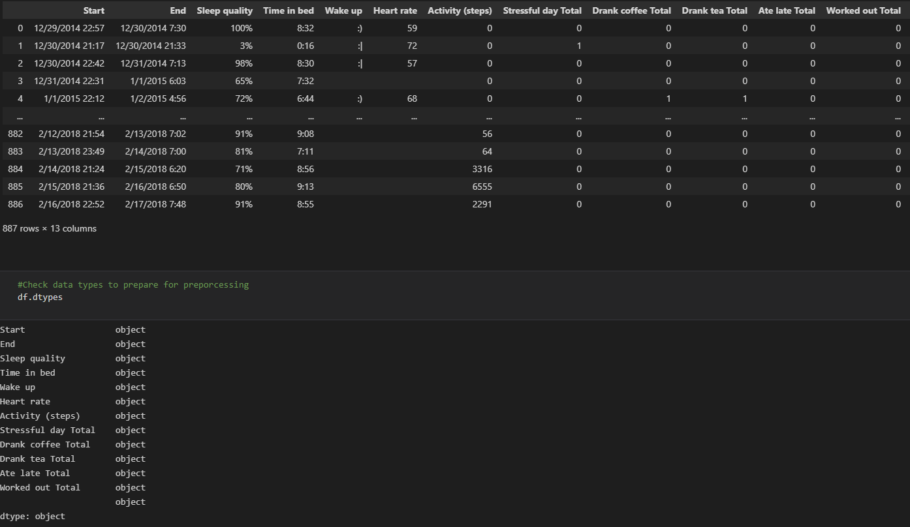
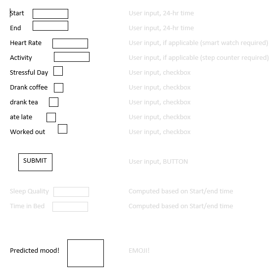
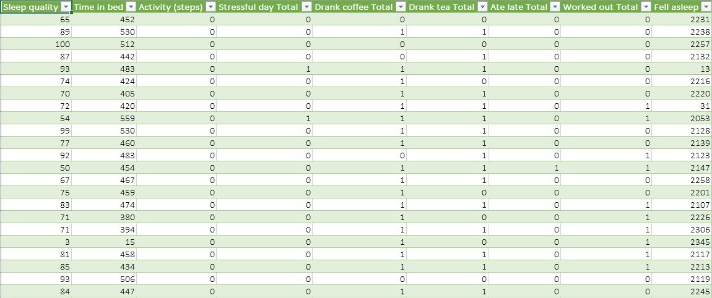

### [Github page](https://mtomison.github.io/Sleep_Analysis/)
# Sleep Analysis
## Overview
This project analyzes sleep data collected from Sleep Cycle iOS App on Kaggle in order to determine what contributes to good sleep. Factors examined are caffeine consumption, physical activity, heart rate, and length of time sleeping. We will use machine learning models to predict if a person will have good or poor sleep based on these factors.

#### Questions to answer with the data
> - Which behaviors contribute to quality sleep?
> - How does one quantify "good sleep"?
> - What will my sleep quality be?
> - How well rested will I be?

#### Data discovery and selection
Initially, we looked for topics of interest on Kaggle to see the data that was available.  We came upon the sleep data of an individual who tracked his/her sleep patterns for just over 3 years.  The dataset started with 8 columns, one of which was titled "Sleep Notes" and had several features in it.  Part of the initial clean up of this data was to break those out to separate columns.

*Original Kaggle Data Set* - [Sleep Cycle iOS App ](https://www.kaggle.com/danagerous/sleep-data)

*Starting Data*

*Modified Data*

  
## Data Cleaning

Preliminarily, the data preprocessing and cleaning reduced our dataset to 162 useable data points.  Then the plan was to try to predict what emoji would result.  Based on this initial plan, a classifier model was selected for our Machine Learning Model.  Once this initial model was run, we determined that the useable data was not enough and using a classifier machine learning model was not appropriate.

## Pivot Direction
We decided to make our target the Sleep Quality feature as it has more outcomes to predict. This change in plan required more preprocessing. A df_tranformed.csv has been generated where all features are in the form of a 1 or 0, allowing for model functionality and keeping 887 complete rows of data. 

## Final Product
### [Finished Model](https://github.com/mtomison/Sleep_Analysis/tree/main/Finished_models)

### [Web Page](https://github.com/mtomison/Sleep_Analysis/tree/main/Presentation)

## [Dashboard](https://public.tableau.com/app/profile/misty.tomison/viz/SleepAnalysis_16403125127800/SleepAnalysis?publish=yes)
### Visualizing the Data with Tableau:

1. [Wake Up](https://public.tableau.com/app/profile/megan.speaks/viz/WakeUp/WakeUp)
2. [Sleep Notes](https://public.tableau.com/app/profile/megan.speaks/viz/SleepNotes/SleepNotes)
3. [Activity](https://public.tableau.com/app/profile/megan.speaks/viz/Activity_16405816723450/Activity)
4. [Time in Bed](https://public.tableau.com/app/profile/megan.speaks/viz/TimeinBed/TimeinBed)
5. [Heart Rate](https://public.tableau.com/app/profile/megan.speaks/viz/HeartRate_16405815842860/HeartRate)
