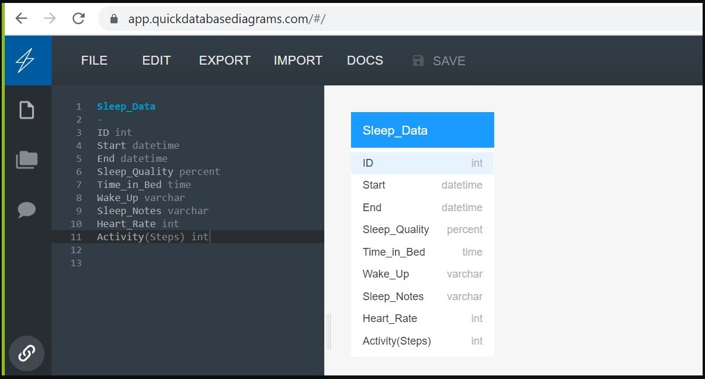

# Sleep Analysis
## Overview
This project analyzes sleep data collected from Sleep Cycle iOS App in order to determine what contributes to good sleep. Factors examined are caffeine consumption, physical activity, heart rate, and length of time sleeping. We will use machine learning models to predictt if a person will have good or poor sleep based on these factors.

#### Questions to answer with the data

> - Which behaviors contribute to quality sleep?
> - How does one quantify "good sleep"?
> - What will my sleep quality be?
> - How well rested will I be?

## [Presentation](https://github.com/mtomison/Sleep_Analysis/blob/gh-pages/Sleep%20Analysis%20Deliverable%202%20Draft%20v2.pdf)

### Content
#### Selected topic

  Sleep Study
  
#### Reason for topic selection
  
  The information is truly valuable with a broad scope of application
  

## [Machine Learning Model](https://github.com/mtomison/Sleep_Analysis/blob/gh-pages/Machine%20Learning.md)
- Preliminary data preprocessing originally limited our usable data to only 162 rows. We have decided to make our target the Sleep Quality feature as it is more outcomes to predict. This change in plan required more preprocessing. A df_tranformed.csv has been generated where all features are in the form of a 1 or 0, allowing for model functionality and keeping 887 complete rows of data. *Updated December 30*
- Before deciding to switch our target we were planning to predict an emoji symbol that represents the mood one should wake up in based upon other features.
This limited our data-frame to only 162 rows, and only one of two outcomes. After some deliberation it made more sense to drop that column and try to predict Sleep Quality on a scale of 1-100. Models have been started.

[Preprocessing Jupyter Notebook](https://github.com/mtomison/Sleep_Analysis/blob/main/sleepDataPreprocessing.ipynb)

## Database
- Description of source data
  
  Sleep Cycle iOS App 
  metrics of caffeine consumption, physical activity, heart rate, and length of time sleeping
  
  We are using Mongo Atlas and Mongo Compass to store and access our data set.  
  

## [Dashboard](https://public.tableau.com/app/profile/misty.tomison/viz/SleepAnalysis_16403125127800/SleepAnalysis?publish=yes)
### Visualizing the Data with Tableau:

1. [Wake Up](https://public.tableau.com/app/profile/megan.speaks/viz/WakeUp/WakeUp)
2. [Sleep Notes](https://public.tableau.com/app/profile/megan.speaks/viz/SleepNotes/SleepNotes)
3. [Activity](https://public.tableau.com/app/profile/megan.speaks/viz/Activity_16405816723450/Activity)
4. [Time in Bed](https://public.tableau.com/app/profile/megan.speaks/viz/TimeinBed/TimeinBed)
5. [Heart Rate](https://public.tableau.com/app/profile/megan.speaks/viz/HeartRate_16405815842860/HeartRate)

## Description of the communication protocols:
All communications are done via Slack, Github branch push/pull/merges for each project team member, and during live class times.
